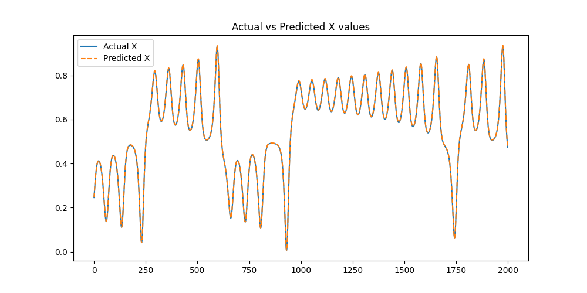
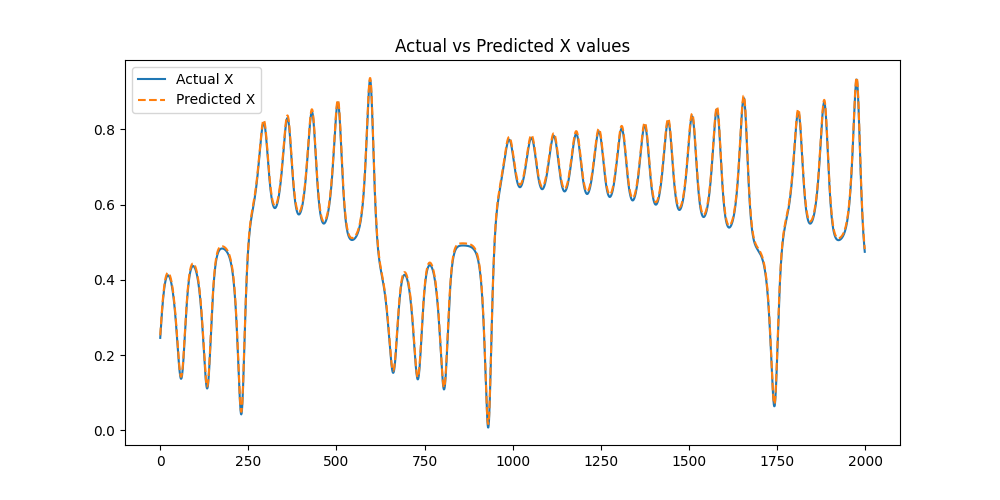

# Chaos-LSTM

This project aims to learn and model chaotic systems using Long Short-Term Memory (LSTM) networks, with a focus on the Lorenz system. The repository includes data generation, preprocessing, model definition, training, and evaluation.

## Project Structure

```
chaos-lstm
│── 📂 src
│   ├── lorenz.py                # Generates Lorenz system data
│   ├── data_preprocessing.py     # Prepares dataset for training
│   ├── lstm_model.py             # Defines LSTM model
│   ├── rnn_model.py              # Defines RNN model
│   ├── visualize.py              # Handles visualization
│
│── 📂 data                       # Auto-created: Stores dataset  
│── 📂 saved_models               # Auto-created: Stores trained models  
│── 📂 results                    # Auto-created: Stores plots  
│
│── 📜 run_all.py                  # 💡 One script to run everything  
│── 📜 requirements.txt             # Dependencies  
│── 📜 README.md                    # Project documentation  
```

## Requirements

- Python 3.10
- Install dependencies via:
  ```bash
  pip install -r requirements.txt
  ```

## How to Run

To execute the full pipeline, use the `run_all.py` script:
```bash
python run_all.py
```
This script will:
- Generate Lorenz system data
- Preprocess the data
- Train both LSTM and RNN models
- Save trained models
- Visualize results

## Results

The following images illustrate the predictions made by the LSTM and RNN models.

### LSTM Model Predictions

 

### RNN Model Predictions



## Model Details

### LSTM Model
The LSTM model is defined in `src/lstm_model.py` and is used to predict the chaotic behavior of the Lorenz system.

### RNN Model
The RNN model is defined in `src/rnn_model.py` and is also applied to model the chaotic behavior.


## Author
Adeniyi John