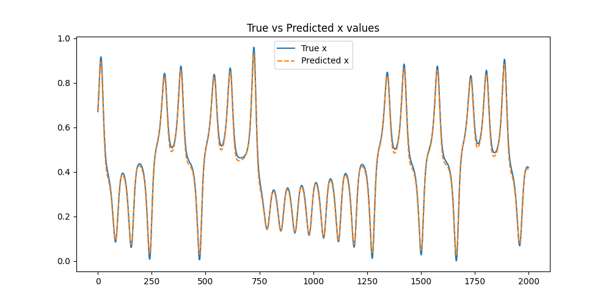

# Chaotic Systems-LSTM

This project aims to learn and model chaotic systems using Long Short-Term Memory (LSTM) networks and Recurrent Neural Networks (RNNs), with a focus on the Lorenz system. The repository includes data generation, preprocessing, model definition, training, and evaluation.

## Project Structure

```
chaos-lstm
│── 📂 src
│   ├── lorenz.py                 # Generates Lorenz system data
│   ├── data_preprocessing.py     # Prepares dataset for training
│   ├── lstm_model.py             # Defines LSTM model
│   ├── rnn_model.py              # Defines RNN model
│   ├── visualize.py              # Handles visualization of predictions
│   ├── train.py                  # Trains both the LSTM and RNN models
│
│── 📂 data                       # Auto-created: Stores dataset  
│── 📂 saved_models               # Auto-created: Stores trained models (LSTM and RNN models)
│── 📂 results                    # Auto-created: Stores plots of predictions
│── 📂 logs                       # Auto-created: Stores logs from script executions
│
│── 📜 run_all.py                 # 💡 One script to run everything (generate, preprocess, train and visualize)
│── 📜 requirements.txt           # Dependencies 
│── 📜 README.md                  # Project documentation

```

## Requirements

- Python 3.10
- Install dependencies via:
  ```bash
  pip install -r requirements.txt
  ```

## How to Run

To execute the full pipeline, use the `run_all.py` script:
```bash
python run_all.py
```
This script will:
- Generate Lorenz system data (if not already present)
- Preprocess the data
- Train both the LSTM and RNN models
- Save the trained models
- Visualize the results by plotting predictions for both the LSTM and RNN models

The log of the script execution will be saved in the `logs/run_log.txt` file. The plots of the predictions for both models will be saved in the `results/` directory.

## Results

### Model Predictions

Both the **LSTM** and **RNN** models are trained and evaluated on the Lorenz system data. The following images illustrate the predictions made by both models.

#### LSTM Model Predictions



#### RNN Model Predictions


### Training Loss Curves

The training loss curves for both models provide insights into the models' training performance. These plots show how the loss decreased over epochs for both the LSTM and RNN models, indicating their learning progress.

#### LSTM Training Loss Curve


#### RNN Training Loss Curve


### Lorenz Attractor Visualization

The Lorenz attractor, generated during the data creation phase, can also be visualized to understand the chaotic behavior of the system.


## Model Details

### LSTM Model
The LSTM model is defined in `src/lstm_model.py` and is used to predict the chaotic behavior of the Lorenz system. LSTM is particularly suited for time-series data, making it a good choice for modeling chaotic systems.

### RNN Model
The RNN model is defined in `src/rnn_model.py` and is also applied to model the chaotic behavior. Although RNNs are also suitable for time-series data, they may not capture long-term dependencies as effectively as LSTMs, which is reflected in the model's performance.

Both models are trained using the same dataset and hyperparameters (with early stopping to prevent overfitting), but they may yield different results due to their architectural differences.

## Author
Adeniyi John